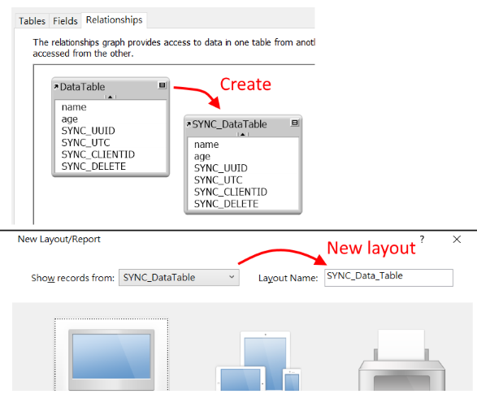
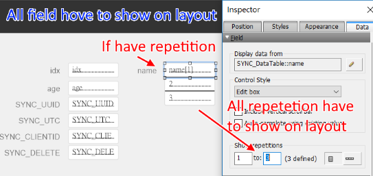
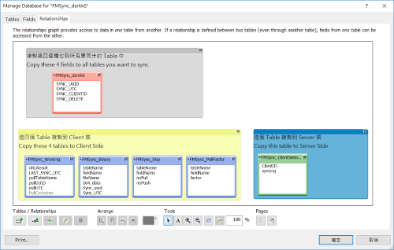

# Server 需求
- FileMaker Server 13+ (可自行測試較低版本)
- PHP 5.6+ with Web Server ( IIS, Apache... etc )
- PHP 必須啟用 cURL , mb_string Module
- 對應 FMS 版本的 FM_API_for_PHP (可在 FMS 的 Web Publishing 底下找到)
- EzFMDB Library on [Github](https://github.com/darkk6/EzFMDB)
  
# 建議設定
- Web Server 或 PHP 提高 POST 上限 (因為可能會傳輸大檔案)
- PHP 抑制錯誤訊息
  
  
# 設定步驟  
開啟要設定的 FileMaker 檔案以及 FMSync_darkk6.fmp12 以便設定  
  
#### 1. 複製欄位 (Server , Client)
- 在所有需要同步的表格中加入同步用的四個欄位 SYNC_UUID , SYNC_UTC , SYNC_CLIENTID , SYNC_DELETE
- 最快的方式就是直接複 FMSync_darkk6 Table 中的四個欄位過去
  
#### 2. 新增資料表 Occurrence (Server , Client)
- 在資料庫的「關係圖」中，將所有要同步的 Table 都建立一個 Occurrence，並加上 SYNC_ 前綴
- 如要同步「Data_Table」，就要新增一個「SYNC_Data_Table」的 Occurrence
- 對於上述每個 SYNC_ 開頭的表格都指定一個同樣名稱的 Layout
- 所有 SYNC_ 開頭的 Layout 都要將所有欄位建立到 Layout 上
- 承上，若有 Repetition 欄位，也要全部顯示  
  

---

  
  
#### 3. 複製工作用 Table (Server 與 Client 有所不同)
- 開啟 FMSync_darkk6.fmp12 , 並依照「關係圖」中的提示，將指定表格複製過去
- 務必做完此動作後再匯入 Scripts  
  

  
  
#### 4. 放置 Layout 元件 (Client Only)
- 將 FMSync_darkk6.fmp12 中 FMSync_Working 的 Layout 上所有元件複製過去
- 三個必要欄位務必要放置
- 文字訊息可以自行更動位置或配色
  
  
#### 5. 匯入 Script (Server 與 Client 有所不同)
- 請根據 FMSync_darkk6.fmp12 Script 中的分類，將指定 Script 複製過去(匯入)
- FMSync_Util 在 Server 和 Client 端都可用，若需要也可匯入
  
  
#### 6. 放置 PHP 檔案 (Server Only)
- 將 PHP 資料夾中的檔案布置到 FileMaker Server 中
- FM_PHP_API 和 EzFMDB 請自行準備並放置到指定位置
- 設定好 PHP 連線設定 (config/Config.php)
  
  
#### 7. 調整同步設定 (Client Only)
- 開啟 **0. FMSync Setting** Script 修改需要的設定
  
  
#### A. 刪除設定
由於實際刪除的資料無法被同步，建議設計資料表時，不要真的刪除資料，  
而是改用類似 is_delete 的欄位紀錄該資料被刪除。  
若真的需要刪除資料，請先不要實際刪除紀錄，而是將 SYNC_DELETE 設為 1  
並於 **0. FMSync Setting** 中啟用刪除資料設定(FMSYNC_DELETE_MARK_RECORD)，  
Client 端會在同步完成後實際刪除這些資料。  
Server 端亦可以透過 Script 刪除這些資料(不建議，刪除後若有尚未同步的 Client 會無法得知)  
  
  
# 同步調整

Client 端提供兩個 Table 針對同步進行設定，分別是： **FMSync_Skip** 和 **FMSync_PullFactor**  
  
#### FMSync_Skip
- 當啟用 _$$FMSYNC_USE_SKIP_LIST_ 時，此處填寫同步要過略的欄位或資料表
- **onPush** 為 1 代表指定欄位或資料表不會上傳給 Server
- **onPull** 為 1 代表指定欄位或資料表被 Server 資料影響
- **tableName** 必須填寫 SYNC_ 開頭的名稱
- **fieldName** 可寫 * 代表跳過整個 table  
  
| tableName      |fieldName | onPush | onPull |  
|:--------------:|:--------:|:------:|:------:|  
|SYNC_Data_Table |name      |1       |0       |  
|SYNC_Data_Table |age       |0       |1       |  
|SYNC_Data_Table |note      |1       |1       |  
|SYNC_NoSync     |*         |1       |1       |  
  
```
當 FMSync 傳送資料給 Server 時，會跳過 :
    SYNC_Data_Table::name
    SYNC_Data_Table::note
    SYNC_NoSync (整個 table)
	
當 FMSync 從 Server 接收資料時，會跳過 :
    SYNC_Data_Table::age
    SYNC_Data_Table::note
    SYNC_NoSync (整個 table)
```
  
  
#### FMSync_PullFactor
- 若向 Server 要資料時，只需取得要特定條件的紀錄時，可以填寫此表格
- **tableName** 和 FMSync_Skip 相同
- **fieldName** 指定條件的欄位(此處不可用 * )
- **factor** 指定的條件 ( 和 Perform Find 寫法相同 )
  
| tableName      |fieldName | factor |  
|:--------------:|:--------:|:------:|  
|SYNC_Data_Table |depart_id |==1     |  
|SYNC_Data_Table |age       |<10     |  
  
```
當 FMSync 要從 Server 取得 "SYNC_Data_Table" 的資料時，只會找：
     "depart_id" 等於 1 ( == 代表符合整個欄位值 )
  且 "age"       小於 10
  
的需要更新資料
```