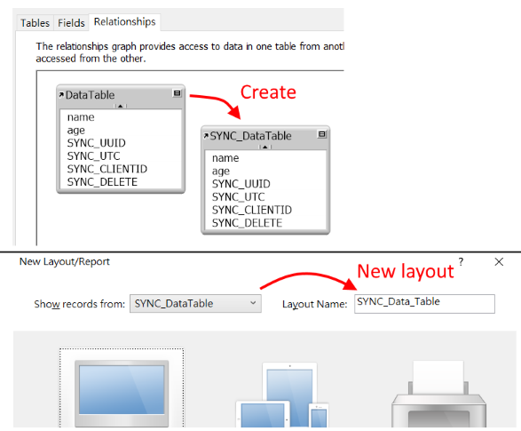

# Server requirement
- FileMaker Server 13+ (You can test lower version your own.)
- PHP 5.6+ with Web Server ( IIS, Apache... etc )
- PHP MUST enable cURL , mb_string modules.
- Right version of FM_API_for_PHP with your FMS
- EzFMDB Library on [Github](https://github.com/darkk6/EzFMDB)
  
# Recommend setting
- Increase max POST size in php.ini (or .htaccess etc.)
- Suppress PHP warning messages
  
  
  
## Detailed document please see my [Blogger](http://darkk6.blogspot.tw/2017/03/fmsync-filemaker-not-plugin.html#more)
  
  
# Setting up  
Open your FM solution and FMSync_darkk6.fmp12  
  
#### 1. Copy SYNC_ fields (Server , Client)
- Add 4 fields into the talbes you want to sync.(SYNC_UUID , SYNC_UTC , SYNC_CLIENTID , SYNC_DELETE)
- The easiest way is copy them from "FMSync_darkk6" table
  
#### 2. Add table occurrence (Server , Client)
- Add another table occurrence for all tables you want to sync and add "SYNC_" prefix
- If you want sync "Data_Table" , add "SYNC_Data_Table" table occurrence base on "Data_Table"
- Create a new layout use the table (SYNC_xxxx) with the same name (SYNC_xxx)
- You have to put ALL the fields on the layout you just create
- Remember show all repetitions if the field have repetitions  
  

---

  
  
#### 3. Copy working tables (Server,Client)
- See the guide in "FMSync_darkk6.fmp12" table relationships chart.
- You MUST finish this step before import scripts  
  

  
  
#### 4. Placeing layout elements (Client Only)
- In "FMSync_Working" layout, copy all elements from "FMSync_darkk6.fmp12" to your solution.
- There are 3 fields that you MUST put on layout
- You can customize your own theme on this layout
  
  
#### 5. Import Scripts (Server,Client)
- Import "FMSync_Client" to your client side solution
- Import "FMSync_Server" to your server side solution
- "FMSync_Util" can be use with both side, import them if you need.
  
  
#### 6. Set up PHP files (Server Only)
- Put all files in PHP folder into your Server.(which is running FMS)
- You have to download and put "FM_PHP_API" and "EzFMDB" lib to the right place on your own
- Configure connection setting (config/Config.php)
  
  
#### 7. Sync options (Client Only)
- Open **0. FMSync Setting** Script and set it up
  
  
#### A. Deletion
Note that, the deleted record can not be sync.   
The better way is to add a field like "is_deleted" instead of really delete.  
If you still want to delete the record, you can use the SYNC_DELETE field.  
First, change your "real delete behavior" to "set value 1 to SYNC_DELETE".  
Then enable delete setting in **0. FMSync Setting** script.(FMSYNC_DELETE_MARK_RECORD)  
After these , client side will delete those record after sync.  
You can also delete those record on server by script(in FMSync_Util).  
But delete those record on server is not recommended.  
  
  
# Sync options

FMSync provides two setting table (Client side) for you : **FMSync_Skip** and **FMSync_PullFactor**  
  
#### FMSync_Skip
- When enable _$$FMSYNC_USE_SKIP_LIST_ , FMSync will skip tables or fields that defined in this table
- **tableName** The table name (with SYNC_ prefix)
- **fieldName** The field name , you can use "*" to skip this table
- **onPush** When 1: data in this field/table will not push to server
- **onPull** When 1: data in this field/table will not pull from server
  
| tableName      |fieldName | onPush | onPull |  
|:--------------:|:--------:|:------:|:------:|  
|SYNC_Data_Table |name      |1       |0       |  
|SYNC_Data_Table |age       |0       |1       |  
|SYNC_Data_Table |note      |1       |1       |  
|SYNC_NoSync     |*         |1       |1       |  

```
When pushing data to serve , FMSync will ignore :
    SYNC_Data_Table::name
    SYNC_Data_Table::note
    SYNC_NoSync (entire table)
	
And ignore data when pulling data from server :
    SYNC_Data_Table::age
    SYNC_Data_Table::note
    SYNC_NoSync (entire table)
```
  
  
#### FMSync_PullFactor
- When pulling data from server, you can filter the record by set up this table
- **tableName** Like FMSync_Skip
- **fieldName** The condition filed name (can NOT use "*" here)
- **factor** Condition value ( Act like Perform Find[] )
  
| tableName      |fieldName | factor |  
|:--------------:|:--------:|:------:|  
|SYNC_Data_Table |depart_id |==1     |  
|SYNC_Data_Table |age       |<10     |  
  
```
When pulling "SYNC_Data_Table" records from server,
FMSync will only pull the record with
    "depart_id" equals to 1 ( == means match entire field )
AND "age" is less then 10
```